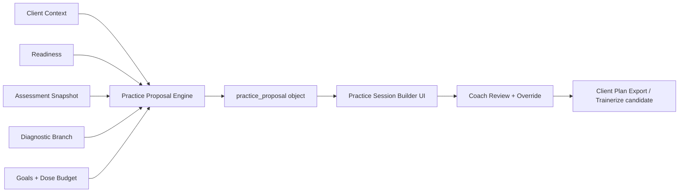

# DRAFT - FOR BRENDAN REVIEW - NOT PRODUCTION - DO NOT WIRE YET

# Forefront Golf Practice Proposal Engine v0.1

> **Status banner:** This document is a draft design specification only. No
> code, schema, validator, Supabase migration, or runtime behavior is
> implied by merging this file. Nothing here is loaded, parsed, or executed
> by the application. Treat this as Brendan-review input for a future
> Practice Proposal Engine layer.

---

## 1. Status and Scope

- **Draft / review only.** This is a v0.1 design proposal for the Practice
  Proposal Engine (PPE). It is not a build ticket and not an
  implementation plan.
- **Not production-wired.** No application code, no validators, no
  Supabase tables, no executable behavior change.
- **No DB migrations yet.** Data contracts listed in §16 are aspirational
  and require Brendan sign-off before any schema work begins.
- **Resolver position.** The PPE sits between the Diagnostic Layer and the
  Practice Session Builder (PSB) UI. It consumes client context,
  diagnostic branch output, readiness, assessment, and a dose budget, and
  emits a structured `practice_proposal` object that the PSB UI renders
  for coach review.
- **Forefront V1 boundary.** The V1 PPE is responsible for **proposal +
  dose + structure resolution only.** Final, individualized drill
  prescription remains human-in-the-loop unless a specific drill family is
  later promoted to a fully validated downstream candidate. The engine
  proposes drill **families** and placeholders; the coach selects and
  finalizes the specific drill, cue, and parameters.

## 2. Problem Statement

Today, Forefront has three good pieces that do not yet compose into a
reliable, reactive client deliverable:

1. The **Practice Session Builder UI** can assemble sessions from blocks
   and drills.
2. The **Diagnostic Layer** can identify a fault, likely cause, proof
   test, and branch intent.
3. The **RLU Dose Model** research provides a principled way to budget
   practice volume in resolved learning units rather than ball count.

What is missing is a single **resolver** that:

- Reads the diagnostic branch, readiness, dose budget, and client context,
- Applies safety gates and stage rules,
- Returns a coach-reviewable, client-sendable, reactive plan with
  explainable decisions and auditable evidence tags.

**Risk if we ship without this layer:** the PSB UI lets a coach assemble
a session that *looks* polished but is unsafe (e.g., high-intent speed
work for a pain-3 client, acquisition drills with no proof test, pressure
practice introduced before a movement pattern is stable). The PPE exists
to make those failure modes structurally impossible at the proposal
stage.

## 3. Goals and Non-Goals

### Goals

- **Safe** by construction. Hard gates eliminate unsafe combinations
  before the coach ever sees them.
- **Stage-aware.** Acquisition vs. refinement vs. transfer vs. retention
  drives block availability and dose shape.
- **Dose-aware.** Every plan is bounded by daily/weekly RLU caps and
  high-intent/pressure caps from the RLU model.
- **Reactive.** Plans carry adaptation rules so the next session
  responds to pass/fail, readiness, equipment flags, and homework
  compliance.
- **Coach-reviewable.** Every output is structured for one-pass coach
  review with hidden alternatives and explicit review flags.
- **Client-sendable.** Each proposal produces a plain-language client
  view (what, why, how much, when to stop, what not to do, next retest).
- **Explainable.** Every decision carries an evidence tag
  (`evidence_supported`, `expert_framework`, `coach_override`) and the
  inputs that drove it.
- **Auditable.** Proposal IDs, input snapshots, and decisions are
  persisted (future) so coach overrides and outcomes can be reviewed.

### Non-Goals (V1)

- No autonomous DB writes by the resolver.
- No autonomous client send. Coach must explicitly export/send.
- No final, individualized drill prescription without coach review.
- No new Supabase migrations as part of this spec.
- No replacement of coach judgment. The PPE proposes; the coach decides.
- No retraining of the diagnostic model or RLU model.

## 4. System Position



The PPE is a **pure resolver**: same inputs → same proposal. It does not
mutate state, does not call out to assessment tools, and does not decide
when a session occurs. It only answers: *given everything I know right
now, what is the safest, best-supported plan I can propose?*

## 5. Inputs

| Group | Field | Req/Opt | Notes |
|---|---|---|---|
| client_context | age_category | required | junior / adult / senior |
| client_context | gp_level | required | GP1..GP4 (general practitioner / golfer profile level) |
| client_context | mn_mode | required | maintenance-novelty mode flag (on/off) |
| client_context | handicap_or_skill | required | numeric or band |
| client_context | coach_present | required | bool — supervised vs solo affects drill candidates |
| client_context | tools_available | required | trackman, trackman_3d, video, force, hackmotion, sam, putting_mat, mirror, alignment_sticks, etc. |
| client_context | season_phase | required | offseason / build / in-season / peak |
| client_context | tournament_proximity_days | optional | int; nullable |
| client_context | rehab_status | optional | none / active / cleared-recent / chronic-modify |
| readiness | sleep_hours | required | numeric |
| readiness | pain_vas | required | 0–10 |
| readiness | fatigue_rpe | required | 0–10 |
| readiness | soreness | optional | 0–10 |
| readiness | stress | optional | 0–10 |
| readiness | recent_practice_hours_7d | optional | numeric |
| readiness | recent_round_played_24h | optional | bool |
| goals | primary_goal_code | required | enum: contact, start_line, speed, distance_control, course_mgmt, putting_speed, putting_line, short_game, mobility, mental, equipment |
| goals | secondary_goal_code | optional | same enum |
| goals | phase | required | acquisition / refinement / transfer / retention |
| goals | timeline_weeks | optional | int |
| goals | weekly_availability_minutes | required | int |
| diagnostic_branch | fault | required | code |
| diagnostic_branch | likely_cause | required | code |
| diagnostic_branch | proof_test_id | required | id from `scoring-tests.json` |
| diagnostic_branch | branch_intent | required | code |
| diagnostic_branch | confidence | required | 0–1 |
| diagnostic_branch | contraindications | optional | list of codes |
| assessment_snapshot | trackman | optional | latest session blob ref |
| assessment_snapshot | trackman_3d | optional | latest |
| assessment_snapshot | video | optional | ref |
| assessment_snapshot | force_pressure | optional | ref |
| assessment_snapshot | hackmotion | optional | ref |
| assessment_snapshot | sam_putting | optional | ref |
| assessment_snapshot | tpi_mobility | optional | ref |
| assessment_snapshot | equipment_flags | optional | list of codes (lie, loft, shaft, ball, grip) |
| dose_context | daily_rlu_cap | required | int |
| dose_context | weekly_rlu_target | required | int |
| dose_context | high_intent_cap | required | int — RLU subtype cap |
| dose_context | pressure_cap | required | int |
| dose_context | maintenance_cap | required | int |

## 6. Canonical Output Object

```json
{
  "proposal_id": "pp_2026_05_29_<client>_<n>",
  "status": "draft | ready_for_review | blocked | requires_override",
  "client_context_summary": { },
  "diagnosis_summary": {
    "fault": "...",
    "likely_cause": "...",
    "branch_intent": "...",
    "proof_test_id": "...",
    "confidence": 0.0
  },
  "readiness_verdict": "green | yellow | red",
  "dose_budget": {
    "session_total_rlu": 0,
    "by_type": { "NP": 0, "CV": 0, "CI": 0, "RP": 0, "PR": 0, "SP": 0, "MN": 0 },
    "high_intent_remaining": 0,
    "pressure_remaining": 0
  },
  "required_blocks": ["..."],
  "optional_blocks": ["..."],
  "forbidden_blocks": ["..."],
  "block_plan": [
    {
      "block_id": "...",
      "order": 1,
      "target_rlu": 0,
      "rlu_type": "NP",
      "candidate_drill_families": ["..."],
      "stage_gate": "acquisition",
      "notes": "..."
    }
  ],
  "scoring_plan": {
    "baseline_test_id": "...",
    "retest_id": "...",
    "thresholds": { "pass": "...", "fail": "..." }
  },
  "homework_plan": { },
  "next_session_adaptation_rules": [
    { "trigger": "...", "action": "...", "evidence_tag": "..." }
  ],
  "coach_review_flags": ["..."],
  "client_message": {
    "what": "...", "why": "...", "how_much": "...",
    "when_to_stop": "...", "what_not_to_do": "...", "next_retest": "..."
  },
  "evidence_tags": ["evidence_supported", "expert_framework"],
  "review_required_flags": ["..."]
}
```

## 7. Resolver Flow

The resolver runs in this order. Any step may short-circuit with a
`status: "blocked"` result.

1. **Normalize inputs.** Coerce types, fill defaults, snapshot inputs to
   `proposal_id`.
2. **Run safety gates** (§8). On hard-block, return `status: "blocked"`
   with reason and coach instructions.
3. **Resolve learning stage** from `goals.phase` + diagnostic branch +
   recent history.
4. **Resolve dose budget** using the RLU model (§9), constrained by
   readiness modifiers and `dose_context` caps.
5. **Resolve session duration / time tier** from
   `weekly_availability_minutes`, tournament proximity, and dose budget.
6. **Resolve block scaffold** (§10): produce required, optional,
   forbidden lists for this duration + stage.
7. **Resolve scoring/proof test** (§12) — must yield a baseline and a
   retest unless course-management-only exemption applies.
8. **Resolve candidate drill families** (§11). Families only, not final
   prescription.
9. **Apply contraindications and conflicts** (e.g., pressure block
   cannot precede a passing proof test in acquisition).
10. **Assemble coach plan** with reasoning, evidence tags, alternatives.
11. **Assemble client plan** (simple language, no jargon).
12. **Run quality checks** (§15) → hard errors, cautions, infos.
13. **Return sendability verdict.** `ready_for_review` only if all
    sendability rules pass.

## 8. Safety and Readiness Gates

**Hard gates (block plan or force modify):**

| Condition | Action |
|---|---|
| pain_vas >= 5 | STOP / modify / refer; no high-intent, no speed, no pressure |
| pain_vas 3–4 | Reduce volume; suppress pressure and speed blocks |
| sleep_hours < 6 | Suppress new-pattern acquisition; suppress speed; bias to retention |
| tournament_proximity_days <= 3 | Freeze technique; only retention, course-mgmt, putting/short-game refinement |
| rehab_status = active | Block speed and high-intent; coach_present required for any new-pattern work |
| no proof_test resolvable | Block acquisition block; require coach to supply proof test |
| equipment_flags present and primary_goal = contact | Require A/B equipment check before technique rebuild |
| pressure block requested in acquisition without passing proof | Block pressure block |

**Soft gates (warn / require coach acknowledgement):**

- fatigue_rpe >= 7
- stress >= 7
- recent_practice_hours_7d above weekly RLU target
- diagnostic_branch.confidence < 0.5

## 9. RLU Dose Model Integration

The PPE consumes the RLU model conclusions directly (see
`rlu-dose-model-research.pplx.md`):

- **RLU = Resolved Learning Unit**, defined as one
  *perception–action–evaluation* cycle. **Not** a ball count, not a swing
  count.
- **Types:**
  - `NP` — New Pattern acquisition
  - `CV` — Constant Variability (block practice)
  - `CI` — Contextual Interference (mixed/randomized)
  - `RP` — Refinement Practice
  - `PR` — Pressure Practice
  - `SP` — Speed Practice
  - `MN` — Maintenance Novelty
- Each session exposes **min / target / upper / red-zone** thresholds
  per type.
- **Diminishing returns:** above the upper bound, additional RLU produces
  declining acquisition and rising injury/fatigue risk.
- **1000-ball warning:** any plan that would imply >~1000 ball-strikes
  per session (regardless of RLU math) is flagged as a hard caution. RLU
  is the budget; ball count is a sanity check.

### Practical dose table (placeholder — Brendan to confirm)

| Type | Min | Target | Upper | Red zone | Notes |
|---|---|---|---|---|---|
| NP  | 20  | 40    | 60   | 80      | acquisition only, never with pain_vas >= 3 |
| CV  | 15  | 30    | 50   | 70      | early-stage stabilization |
| CI  | 20  | 40    | 60   | 80      | mid/late stage transfer |
| RP  | 15  | 30    | 50   | 70      | refinement, stage-gated |
| PR  | 10  | 20    | 30   | 40      | pressure cap binds |
| SP  | 10  | 20    | 30   | 40      | suppressed under readiness red |
| MN  | 10  | 20    | 30   | 50      | maintenance only |

## 10. Block Resolver Rules

The PPE uses 11 canonical blocks (aligned with the PSB dataset seed):

1. Warm-up / movement prep
2. Skill acquisition (technique)
3. Skill refinement
4. Constant-block practice
5. Variable practice
6. Random / contextual interference
7. Pressure practice
8. Speed / power
9. Scoring / proof test
10. Course management / transfer
11. Cool-down / retention review

### Required / optional / forbidden by stage

| Stage | Required | Optional | Forbidden |
|---|---|---|---|
| Acquisition | 1, 2, 4, 9, 11 | 3, 5, 6, 10 | 7 (pressure), 8 (speed) until proof passes |
| Refinement | 1, 3, 5, 9, 11 | 2, 4, 6, 7, 10 | none structural; gated by readiness |
| Transfer | 1, 5, 6, 9, 10, 11 | 3, 7, 8 | 2 (no new-pattern acquisition) |
| Retention | 1, 9, 10, 11 | 3, 5, 6, 7, 8 | 2 |

### Block order

Default order: 1 → (2 or 3) → (4 / 5 / 6) → (7 / 8 if allowed) → 9 → 10
→ 11. The resolver may compress blocks for short sessions.

### Duration tiers

| Tier | Required blocks | Notes |
|---|---|---|
| 20 min | 1, 9, 11 | Plus exactly one of 2/3/5; no pressure, no speed |
| 30 min | 1, (2 or 3), 9, 11 | Optional 5 |
| 45 min | 1, (2 or 3), (4 or 5), 9, 11 | Optional 6, 7 |
| 60 min | 1, (2 or 3), (4 or 5), 6, 9, 11 | Optional 7, 8 |
| 90 min | 1, 2/3, 4/5, 6, 7/8, 9, 10, 11 | Full structure |
| 9-hole | 1, 6 (in-play CI), 9 (on-course scoring), 10, 11 | Course replaces 4/5 |
| 18-hole | 1, 10, 9, 11 | Course IS the practice; only retention/cool-down off course |

## 11. Drill Candidate Rules

The PPE proposes **drill families** and placeholders, **not** specific
final drills. Coach selects the concrete drill, cue, and parameters at
review time.

Filtering pipeline for each block:

1. Filter by diagnostic branch intent (e.g., face-control vs path-control).
2. Filter by block (only families valid for this block).
3. Filter by stage (acquisition vs refinement vs transfer vs retention).
4. Filter by `tools_available`.
5. Filter by readiness (e.g., suppress speed if readiness red).
6. Filter by coach_present (some families are coach-only).
7. Filter by conflicts and prior-session usage.
8. Filter by `dose_remaining` for the relevant RLU type.

### Specific candidate rules

- **Contact drills** are primary candidates only when branch intent
  includes contact, low-point, strike quality, equipment-driven loft, or
  dynamic loft. They are otherwise demoted to optional.
- **Pump-style (movement priming) drills** may be primary only **once**
  per session. Later appearances are allowed only as carryover/context
  pairing, never as a second primary acquisition drill.
- **Pressure drills** require a passed proof test for the underlying
  pattern in the prior or current session.

### Fields needed on each drill card (`drill-cards.v1.json`)

- `drill_id`, `family`, `name`, `block_ids`, `branch_intents`,
  `stages`, `tools_required`, `coach_only`, `rlu_type`,
  `default_rlu_target`, `contraindications`, `evidence_tag`,
  `client_facing_name`, `client_facing_cue`, `setup_steps`,
  `success_criterion`, `failure_criterion`, `progression_id`,
  `regression_id`, `pair_with_drill_ids`, `forbidden_pair_drill_ids`,
  `notes_for_coach`.

## 12. Scoring / Test Selection Rules

Every proposal must include a baseline and a retest **unless** the plan
is course-management-only (e.g., pre-tournament retention day).

Selection logic:

1. Start from `diagnostic_branch.proof_test_id`.
2. Validate the test is feasible given `tools_available`.
3. If not feasible, downgrade through a priority chain
   (instrumented → observational → behavioral outcome).
4. Choose retest = same test unless branch intent calls for a
   transfer-context retest.

### What to score by goal area

| Goal area | Score |
|---|---|
| Swing technique | proof-test pass rate, kinematic delta |
| Speed | clubhead speed delta, smash factor band |
| Putting line | start-line dispersion |
| Putting speed | distance control variance |
| Short game | proximity to hole, landing window hit rate |
| Course management | decision quality score, target hit rate |

### Pass/fail and progression

| Result | Action |
|---|---|
| pass_rate >= 85% | Plan was too easy → progress next session (harder context / CI / pressure / speed) |
| pass_rate 65–85% | Goldilocks zone → repeat or refine |
| pass_rate < 65% | Too hard → regress (more CV, less CI, simpler context) |
| pass_rate fail on retest after 2–3 sessions | Re-diagnose; consider equipment A/B or branch change |

## 13. Reactive Adaptation Rules

| Trigger | Action | Rationale | Evidence tag |
|---|---|---|---|
| Proof pass (>=85%) on retest | Promote to next stage; reduce CV, add CI/PR | Skill stabilized | evidence_supported |
| Proof fail on retest | Hold stage; increase CV, reduce CI | Pattern not stable | evidence_supported |
| Readiness red (pain >=5 or sleep <6) | Suppress acquisition + speed + pressure; switch to retention/MN | Safety + acquisition impairment | evidence_supported |
| pain_vas 3–4 | Reduce session_total_rlu by 30–50%; remove pressure/speed | Pain reduces learning + raises injury risk | evidence_supported |
| Equipment flag triggered | Insert equipment A/B before next technique block | Avoid building pattern on bad equipment | expert_framework |
| No improvement after 2–3 sessions | Re-diagnose; consider branch change or coach escalation | Diagnostic confidence in question | expert_framework |
| pass_rate > 85% two sessions in a row | Drill is too easy → progress | Plateau risk | evidence_supported |
| pass_rate < 65% | Regress block intensity, simplify cue | Overload | evidence_supported |
| Technical dependency (only succeeds with one specific cue) | Add transfer/CI; remove primary cue progressively | Cue-dependent skill ≠ transferable skill | expert_framework |
| Missed homework | Repeat prior plan; do not progress | No evidence of consolidation | expert_framework |
| Tournament within 3 days | Freeze technique; lock retention + course mgmt | Performance window | evidence_supported |

## 14. Coach vs Client Output

### Coach output includes

- Diagnostic reasoning, branch confidence, alternatives considered.
- Evidence tag per decision.
- Hidden alternatives (drill families not chosen, with reasons).
- Coach review flags (review-required items, overrides used).
- Full dose budget breakdown with caps.

### Client output includes

Plain language, no jargon, no internal codes, no RLU references unless
Brendan decides to expose them externally (see §19).

- **What** to do.
- **Why** in one sentence.
- **How much** (time-bounded or rep-bounded).
- **When to stop** (pain, technique breakdown, fatigue cues).
- **What not to do** (specific anti-pattern call-outs).
- **Next retest** (when and what).

### Sample client-facing mini plan

```
Today (about 45 minutes)

1. Warm up your body and feel (8 min)
   - Slow swings, half speed, focus on a balanced finish.
2. Build your move (15 min)
   - 3 sets of 6 swings working on the pattern your coach picked.
   - Stop if your lead-side hip starts hurting more than a 3/10.
3. Test it (8 min)
   - 10 shots, same target. Track how many start where you aimed.
4. Use it (10 min)
   - Mix targets. Don’t use the cue out loud — just trust it.
5. Cool down (4 min)
   - 5 easy swings, breathing slow, finish on a good one.

Goal: 7 of 10 starting on your aim line on the test.
Retest: next session.
Don’t add speed or pressure until you pass twice in a row.
```

## 15. Quality Checks / Sendability

**Hard errors** (block sendability):

- Any unresolved safety gate.
- Missing required block for the duration tier.
- Dose total above daily_rlu_cap.
- Dose subtype above high_intent_cap or pressure_cap.
- No proof test selected (unless course-mgmt-only exemption).
- Cue count > 1 active cue in client_message.
- Stage/block incompatibility (e.g., NP block in retention plan).
- Forbidden drill family or block present.
- Missing or empty `client_message`.

**Cautions** (sendable with coach acknowledgement):

- diagnostic_branch.confidence < 0.5.
- Two consecutive sessions with same primary drill family.
- Tools list missing primary instrumentation for chosen proof test.
- Estimated ball count > 1000 sanity threshold.

**Infos** (display only):

- Stage transition this session.
- Dose near cap (within 10%).

A plan is **sendable** only if **all** of:
1. Safety gates pass.
2. Required blocks present.
3. Dose within all caps.
4. Proof + retest present (or valid exemption).
5. Cue count OK.
6. Stage–block compatibility OK.
7. No forbidden block/drill.
8. `client_message` complete.

## 16. Data Contracts Needed

These are **proposals**, not commitments. Each requires Brendan
sign-off before any schema work.

| File | Purpose | Key fields |
|---|---|---|
| `practice-dose-model.json` | RLU caps and thresholds | type, min, target, upper, red_zone, per_stage_modifiers, per_age_modifiers |
| `drill-cards.v1.json` | Canonical drill library | see §11 field list |
| `diagnostic-branch-rules.json` | Branch → intent → proof test mapping | fault, likely_cause, branch_intent, proof_test_id, contraindications, confidence_floor |
| `scoring-tests.json` | Proof and retest definitions | test_id, instrumentation, pass_threshold, fail_threshold, fallback_test_ids |
| `client-adaptation-rules.json` | Reactive rules table | trigger, condition, action, evidence_tag, priority |
| `session-template-resolver.json` | Duration → block scaffold mapping | duration_tier, required_blocks, optional_blocks, forbidden_blocks, order |
| `practice-proposal-schema.json` *(optional)* | JSON schema for the output object in §6 | matches §6 |

## 17. MVP Build Plan

### P0 — must ship to call PPE v1 useful

- Safety gates (§8) implemented as pure functions.
- Dose budget resolver consuming `practice-dose-model.json`.
- Block resolver consuming `session-template-resolver.json`.
- Proof + retest selection consuming `scoring-tests.json`.
- Candidate drill **families** (not final drills) per block.
- Sendability verdict with hard errors / cautions / infos.
- Coach output object (§6) + client message (§14).

**P0 acceptance:** Given a fixed input fixture, the resolver returns the
same `practice_proposal` on every run; manual QA over scenarios in §18
passes coach review without unsafe combinations.

### P1 — should ship soon after

- Reactive adaptation rules engine (§13) consuming
  `client-adaptation-rules.json`.
- Diagnostic-branch loader consuming `diagnostic-branch-rules.json`.
- Persistent proposal history (read-only audit).
- Coach override capture with evidence tag.

**P1 acceptance:** Given a sequence of (proposal → coach review →
session result), the next proposal correctly applies adaptation rules.

### P2 — later

- Trainerize export adapter.
- Client-facing client-message generator with tone presets.
- Multi-day plan composition (consume daily progressive prescription).
- Coach-facing "what changed and why" diff view.

## 18. QA Scenario Matrix

| # | Scenario | Expected behavior |
|---|---|---|
| 1 | New swing change (NP) | Acquisition + CV + proof; no PR/SP |
| 2 | Slice — face vs path branch | Branch resolves; correct proof test (face-to-path or D-plane) |
| 3 | Contact / low-point | Contact drill family primary; equipment A/B if flagged |
| 4 | Driver vs iron divergence | Two proof tests or staged sessions |
| 5 | Speed work + readiness yellow | Speed reduced or removed; coach caution surfaced |
| 6 | Putting start-line | Start-line proof test; SAM if available |
| 7 | Putting speed | Distance-control proof; CV → CI progression |
| 8 | Wedge distance | Landing-window proof test; CI bias |
| 9 | Bunker fear | Retention/transfer bias; no pressure |
| 10 | Equipment-driven contact | A/B block before technique rebuild |
| 11 | Senior, mobility-limited | TPI flags consumed; NP and SP suppressed or modified |
| 12 | Junior | Reduced session duration; MN bias; no high-intent caps |
| 13 | Post-rehab | Rehab gate suppresses speed and high-intent; coach_present required |
| 14 | Tournament week | Technique frozen; retention + course mgmt only |
| 15 | Course-management only | Proof-test exemption applies; client_message simplified |

For each scenario, expected outputs: sendability verdict, dose budget,
blocks selected, forbidden blocks, coach flags, client_message.

## 19. Brendan Review Queue

Decisions required before any portion of this spec is wired:

1. **RLU naming.** Client-facing label vs internal label. Do we expose
   "RLU" externally, or use plain language only?
2. **Exact caps.** Confirm or replace the placeholder numbers in §9.
3. **Sendability threshold.** Are §15’s hard-error rules the right
   list, or should some be cautions instead?
4. **Required-for-MVP fields.** Of §5 inputs, which are truly required
   in V1 vs deferred to V2?
5. **Coach override scope.** Can the coach override a hard safety gate?
   If yes, with what audit trail?
6. **Trainerize / export format.** What is the canonical export schema?
7. **Storage.** Where do `practice_proposal` records live? Supabase
   table, JSONB column, or out-of-DB audit log?
8. **Client plan complete.** What constitutes a "complete" client plan
   for export — fields, length, language constraints?
9. **Diagnostic confidence floor.** Below what confidence do we refuse
   to propose at all vs warn?
10. **MN mode semantics.** How does `mn_mode` change block + dose
    selection? Brendan to define.

## 20. Appendix: Example `practice_proposal`

```json
{
  "proposal_id": "pp_2026_05_29_demo_001",
  "status": "ready_for_review",
  "client_context_summary": {
    "age_category": "adult",
    "gp_level": "GP2",
    "mn_mode": false,
    "handicap_or_skill": 8.4,
    "coach_present": true,
    "tools_available": ["trackman", "video", "alignment_sticks"],
    "season_phase": "build",
    "tournament_proximity_days": null,
    "rehab_status": "none"
  },
  "diagnosis_summary": {
    "fault": "face_open_at_impact",
    "likely_cause": "trail_wrist_extension_late",
    "branch_intent": "face_control_via_wrist_geometry",
    "proof_test_id": "proof_face_to_path_window",
    "confidence": 0.72
  },
  "readiness_verdict": "green",
  "dose_budget": {
    "session_total_rlu": 110,
    "by_type": { "NP": 40, "CV": 30, "CI": 20, "RP": 0, "PR": 0, "SP": 0, "MN": 20 },
    "high_intent_remaining": 30,
    "pressure_remaining": 30
  },
  "required_blocks": ["warmup", "acquisition", "constant_block", "proof_test", "cooldown"],
  "optional_blocks": ["variable", "transfer"],
  "forbidden_blocks": ["pressure", "speed"],
  "block_plan": [
    { "block_id": "warmup", "order": 1, "target_rlu": 10, "rlu_type": "MN", "candidate_drill_families": ["mobility_prep", "feel_swings"], "stage_gate": "any", "notes": "" },
    { "block_id": "acquisition", "order": 2, "target_rlu": 40, "rlu_type": "NP", "candidate_drill_families": ["wrist_geometry_isolation"], "stage_gate": "acquisition", "notes": "single primary cue" },
    { "block_id": "constant_block", "order": 3, "target_rlu": 30, "rlu_type": "CV", "candidate_drill_families": ["face_window_repetition"], "stage_gate": "acquisition", "notes": "" },
    { "block_id": "proof_test", "order": 4, "target_rlu": 20, "rlu_type": "CI", "candidate_drill_families": ["face_to_path_window_test"], "stage_gate": "any", "notes": "10 shots, single target" },
    { "block_id": "cooldown", "order": 5, "target_rlu": 10, "rlu_type": "MN", "candidate_drill_families": ["retention_review"], "stage_gate": "any", "notes": "" }
  ],
  "scoring_plan": {
    "baseline_test_id": "proof_face_to_path_window",
    "retest_id": "proof_face_to_path_window",
    "thresholds": { "pass": ">=7/10 in window", "fail": "<5/10 in window" }
  },
  "homework_plan": {
    "between_session_minutes": 15,
    "items": [
      { "name": "mirror wrist set", "reps": "2x10", "frequency": "daily" }
    ]
  },
  "next_session_adaptation_rules": [
    { "trigger": "proof pass >=8/10", "action": "introduce CI block", "evidence_tag": "evidence_supported" },
    { "trigger": "proof fail <5/10", "action": "repeat acquisition, increase CV", "evidence_tag": "evidence_supported" }
  ],
  "coach_review_flags": ["diagnostic_confidence_moderate"],
  "client_message": {
    "what": "Build a better wrist position at impact, then test it.",
    "why": "Your clubface is open at impact because your trail wrist stays extended too long.",
    "how_much": "About 45 minutes total.",
    "when_to_stop": "Stop if lead-side pain goes above a 3/10 or if your finish loses balance for 3 swings in a row.",
    "what_not_to_do": "Do not add speed or play targets in pressure mode until you pass the test twice.",
    "next_retest": "Next session — same 10-shot window test."
  },
  "evidence_tags": ["evidence_supported", "expert_framework"],
  "review_required_flags": []
}
```

---

*End of v0.1 draft. Update this file in place during Brendan review;
bump to v0.2 once decisions in §19 are resolved.*
